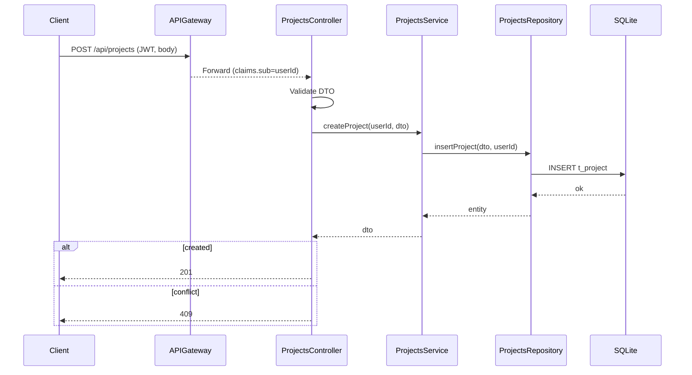

```mermaid
sequenceDiagram
  participant Client
  participant APIGateway
  participant ProjectsController
  participant ProjectsService
  participant ProjectsRepository
  participant SQLite
  Client->>APIGateway: POST /api/projects (JWT, body)
  APIGateway-->>ProjectsController: Forward (claims.sub=userId)
  ProjectsController->>ProjectsController: Validate DTO
  ProjectsController->>ProjectsService: createProject(userId, dto)
  ProjectsService->>ProjectsRepository: insertProject(dto, userId)
  ProjectsRepository->>SQLite: INSERT t_project
  SQLite-->>ProjectsRepository: ok
  ProjectsRepository-->>ProjectsService: entity
  ProjectsService-->>ProjectsController: dto
  alt created
    ProjectsController-->>Client: 201
  else conflict
    ProjectsController-->>Client: 409
  end
```
