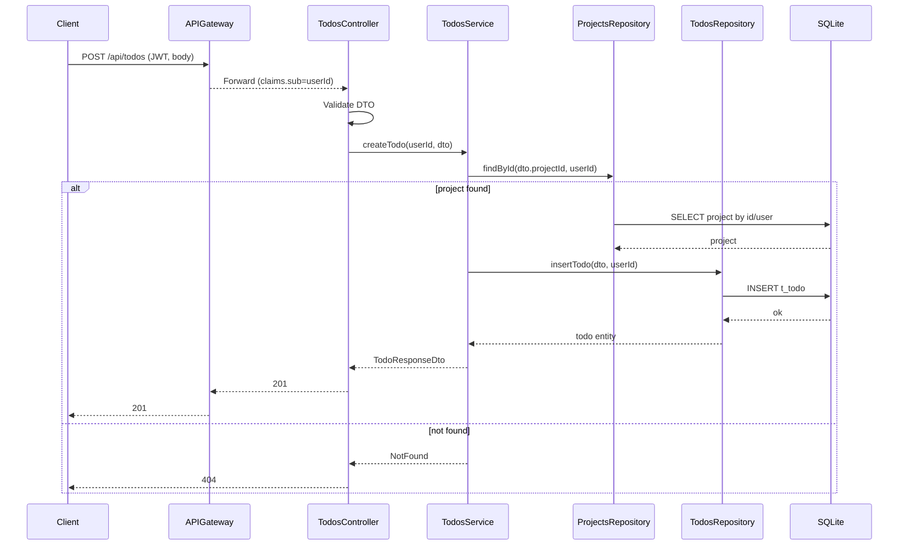

```mermaid
sequenceDiagram
  participant Client
  participant APIGateway
  participant TodosController
  participant TodosService
  participant ProjectsRepository
  participant TodosRepository
  participant SQLite
  Client->>APIGateway: POST /api/todos (JWT, body)
  APIGateway-->>TodosController: Forward (claims.sub=userId)
  TodosController->>TodosController: Validate DTO
  TodosController->>TodosService: createTodo(userId, dto)
  TodosService->>ProjectsRepository: findById(dto.projectId, userId)
  alt project found
    ProjectsRepository->>SQLite: SELECT project by id/user
    SQLite-->>ProjectsRepository: project
    TodosService->>TodosRepository: insertTodo(dto, userId)
    TodosRepository->>SQLite: INSERT t_todo
    SQLite-->>TodosRepository: ok
    TodosRepository-->>TodosService: todo entity
    TodosService-->>TodosController: TodoResponseDto
    TodosController-->>APIGateway: 201
    APIGateway-->>Client: 201
  else not found
    TodosService-->>TodosController: NotFound
    TodosController-->>Client: 404
  end
```
