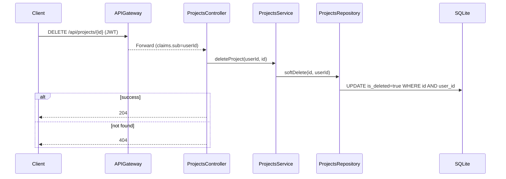

```mermaid
sequenceDiagram
  participant Client
  participant APIGateway
  participant ProjectsController
  participant ProjectsService
  participant ProjectsRepository
  participant SQLite
  Client->>APIGateway: DELETE /api/projects/{id} (JWT)
  APIGateway-->>ProjectsController: Forward (claims.sub=userId)
  ProjectsController->>ProjectsService: deleteProject(userId, id)
  ProjectsService->>ProjectsRepository: softDelete(id, userId)
  ProjectsRepository->>SQLite: UPDATE is_deleted=true WHERE id AND user_id
  alt success
    ProjectsController-->>Client: 204
  else not found
    ProjectsController-->>Client: 404
  end
```
