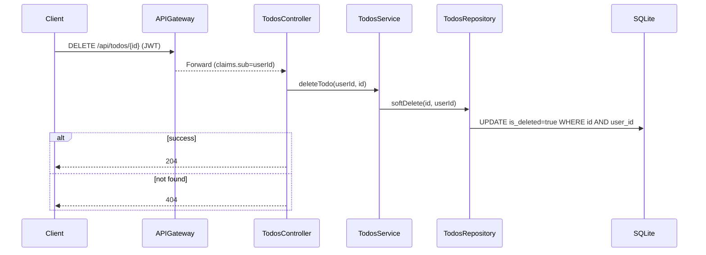

```mermaid
sequenceDiagram
  participant Client
  participant APIGateway
  participant TodosController
  participant TodosService
  participant TodosRepository
  participant SQLite
  Client->>APIGateway: DELETE /api/todos/{id} (JWT)
  APIGateway-->>TodosController: Forward (claims.sub=userId)
  TodosController->>TodosService: deleteTodo(userId, id)
  TodosService->>TodosRepository: softDelete(id, userId)
  TodosRepository->>SQLite: UPDATE is_deleted=true WHERE id AND user_id
  alt success
    TodosController-->>Client: 204
  else not found
    TodosController-->>Client: 404
  end
```
