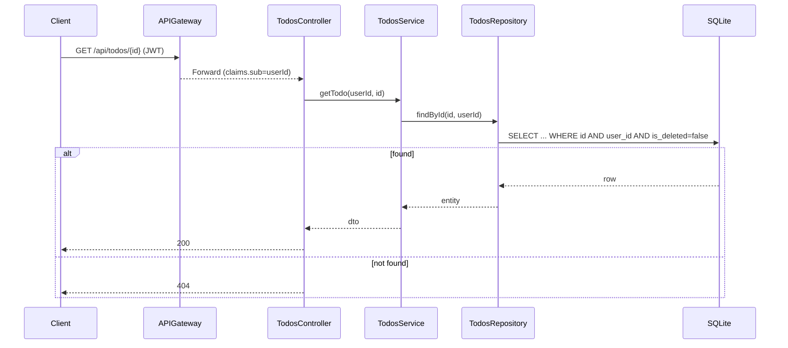

```mermaid
sequenceDiagram
  participant Client
  participant APIGateway
  participant TodosController
  participant TodosService
  participant TodosRepository
  participant SQLite
  Client->>APIGateway: GET /api/todos/{id} (JWT)
  APIGateway-->>TodosController: Forward (claims.sub=userId)
  TodosController->>TodosService: getTodo(userId, id)
  TodosService->>TodosRepository: findById(id, userId)
  TodosRepository->>SQLite: SELECT ... WHERE id AND user_id AND is_deleted=false
  alt found
    SQLite-->>TodosRepository: row
    TodosRepository-->>TodosService: entity
    TodosService-->>TodosController: dto
    TodosController-->>Client: 200
  else not found
    TodosController-->>Client: 404
  end
```
