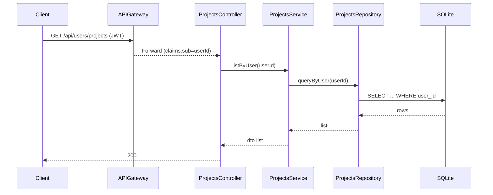

```mermaid
sequenceDiagram
  participant Client
  participant APIGateway
  participant ProjectsController
  participant ProjectsService
  participant ProjectsRepository
  participant SQLite
  Client->>APIGateway: GET /api/users/projects (JWT)
  APIGateway-->>ProjectsController: Forward (claims.sub=userId)
  ProjectsController->>ProjectsService: listByUser(userId)
  ProjectsService->>ProjectsRepository: queryByUser(userId)
  ProjectsRepository->>SQLite: SELECT ... WHERE user_id
  SQLite-->>ProjectsRepository: rows
  ProjectsRepository-->>ProjectsService: list
  ProjectsService-->>ProjectsController: dto list
  ProjectsController-->>Client: 200
```
