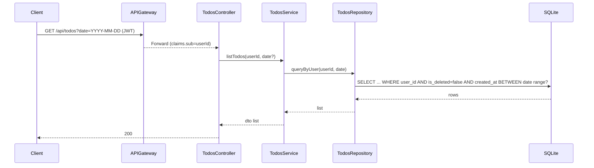

```mermaid
sequenceDiagram
  participant Client
  participant APIGateway
  participant TodosController
  participant TodosService
  participant TodosRepository
  participant SQLite
  Client->>APIGateway: GET /api/todos?date=YYYY-MM-DD (JWT)
  APIGateway-->>TodosController: Forward (claims.sub=userId)
  TodosController->>TodosService: listTodos(userId, date?)
  TodosService->>TodosRepository: queryByUser(userId, date)
  TodosRepository->>SQLite: SELECT ... WHERE user_id AND is_deleted=false AND created_at BETWEEN date range?
  SQLite-->>TodosRepository: rows
  TodosRepository-->>TodosService: list
  TodosService-->>TodosController: dto list
  TodosController-->>Client: 200
```
