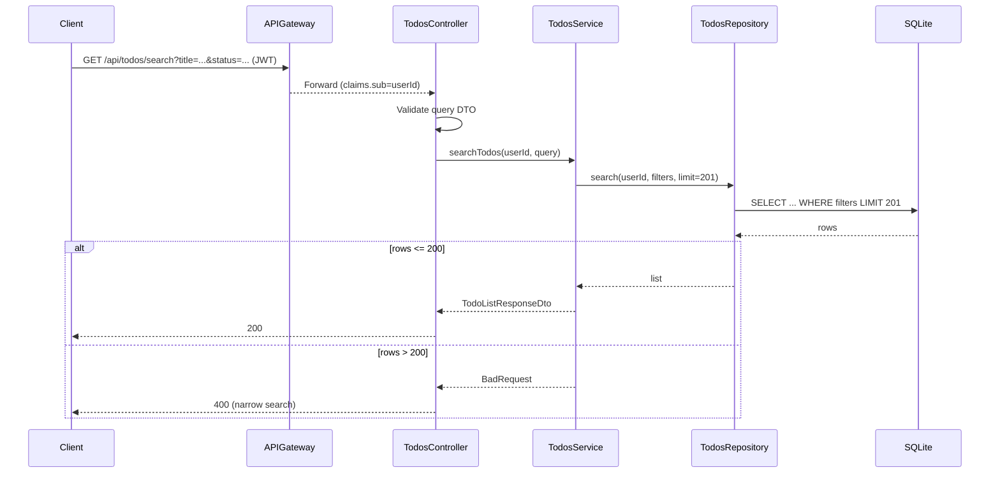

```mermaid
sequenceDiagram
  participant Client
  participant APIGateway
  participant TodosController
  participant TodosService
  participant TodosRepository
  participant SQLite
  Client->>APIGateway: GET /api/todos/search?title=...&status=... (JWT)
  APIGateway-->>TodosController: Forward (claims.sub=userId)
  TodosController->>TodosController: Validate query DTO
  TodosController->>TodosService: searchTodos(userId, query)
  TodosService->>TodosRepository: search(userId, filters, limit=201)
  TodosRepository->>SQLite: SELECT ... WHERE filters LIMIT 201
  SQLite-->>TodosRepository: rows
  alt rows <= 200
    TodosRepository-->>TodosService: list
    TodosService-->>TodosController: TodoListResponseDto
    TodosController-->>Client: 200
  else rows > 200
    TodosService-->>TodosController: BadRequest
    TodosController-->>Client: 400 (narrow search)
  end
```
