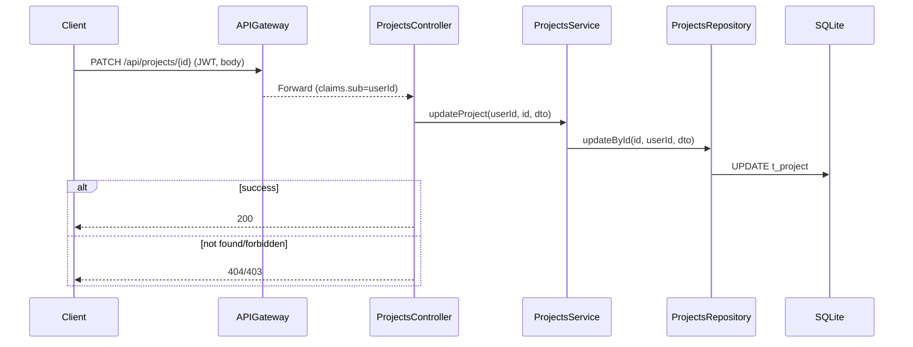

```mermaid
sequenceDiagram
  participant Client
  participant APIGateway
  participant ProjectsController
  participant ProjectsService
  participant ProjectsRepository
  participant SQLite
  Client->>APIGateway: PATCH /api/projects/{id} (JWT, body)
  APIGateway-->>ProjectsController: Forward (claims.sub=userId)
  ProjectsController->>ProjectsService: updateProject(userId, id, dto)
  ProjectsService->>ProjectsRepository: updateById(id, userId, dto)
  ProjectsRepository->>SQLite: UPDATE t_project
  alt success
    ProjectsController-->>Client: 200
  else not found/forbidden
    ProjectsController-->>Client: 404/403
  end
```
