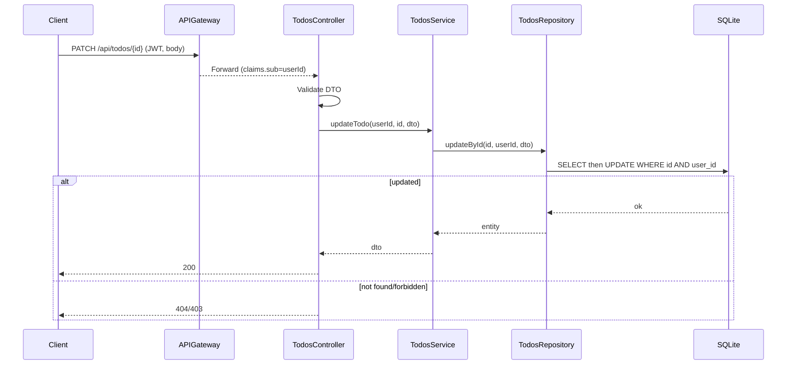

```mermaid
sequenceDiagram
  participant Client
  participant APIGateway
  participant TodosController
  participant TodosService
  participant TodosRepository
  participant SQLite
  Client->>APIGateway: PATCH /api/todos/{id} (JWT, body)
  APIGateway-->>TodosController: Forward (claims.sub=userId)
  TodosController->>TodosController: Validate DTO
  TodosController->>TodosService: updateTodo(userId, id, dto)
  TodosService->>TodosRepository: updateById(id, userId, dto)
  TodosRepository->>SQLite: SELECT then UPDATE WHERE id AND user_id
  alt updated
    SQLite-->>TodosRepository: ok
    TodosRepository-->>TodosService: entity
    TodosService-->>TodosController: dto
    TodosController-->>Client: 200
  else not found/forbidden
    TodosController-->>Client: 404/403
  end
```
