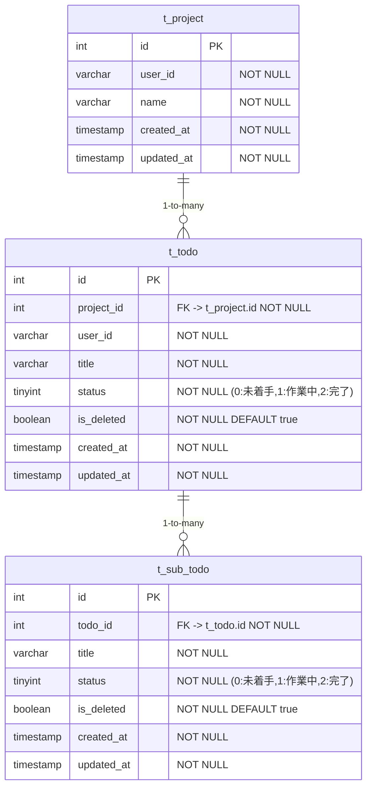

```mermaid
erDiagram
  t_project ||--o{ t_todo : "1-to-many"
  t_todo ||--o{ t_sub_todo : "1-to-many"

  t_project {
    int id PK
    varchar user_id "NOT NULL"
    varchar name "NOT NULL"
    timestamp created_at "NOT NULL"
    timestamp updated_at "NOT NULL"
  }

  t_todo {
    int id PK
    int project_id "FK -> t_project.id NOT NULL"
    varchar user_id "NOT NULL"
    varchar title "NOT NULL"
    tinyint status "NOT NULL (0:未着手,1:作業中,2:完了)"
    boolean is_deleted "NOT NULL DEFAULT true"
    timestamp created_at "NOT NULL"
    timestamp updated_at "NOT NULL"
  }

  t_sub_todo {
    int id PK
    int todo_id "FK -> t_todo.id NOT NULL"
    varchar title "NOT NULL"
    tinyint status "NOT NULL (0:未着手,1:作業中,2:完了)"
    boolean is_deleted "NOT NULL DEFAULT true"
    timestamp created_at "NOT NULL"
    timestamp updated_at "NOT NULL"
  }
```
